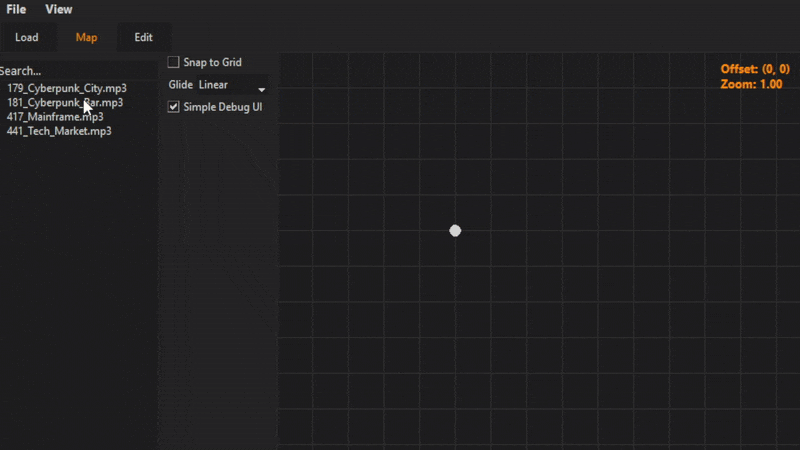

# DND Soundscape



---

## Features
- **Node Based**: Simply drag and drop loaded files into the map and guide the cursor to play.
- **File Support**: Currently supporting .mp3, .ogg and .wav files.
- **Save & Load**: You can save and load your soundscapes to be used later.


## Installation
If you don't want to use the precompiled [release](https://github.com/lemonhandgrenade/DND-Soundscape/releases/latest), you can run it directly using python.  

```bash
# Clone The Repo
git clone https://github.com/lemonhandgrenade/DND-Soundscape.git
cd dnd-soundscape

# Install The Dependencies
pip install -r requirements.txt

# Run The App
python main.py
```